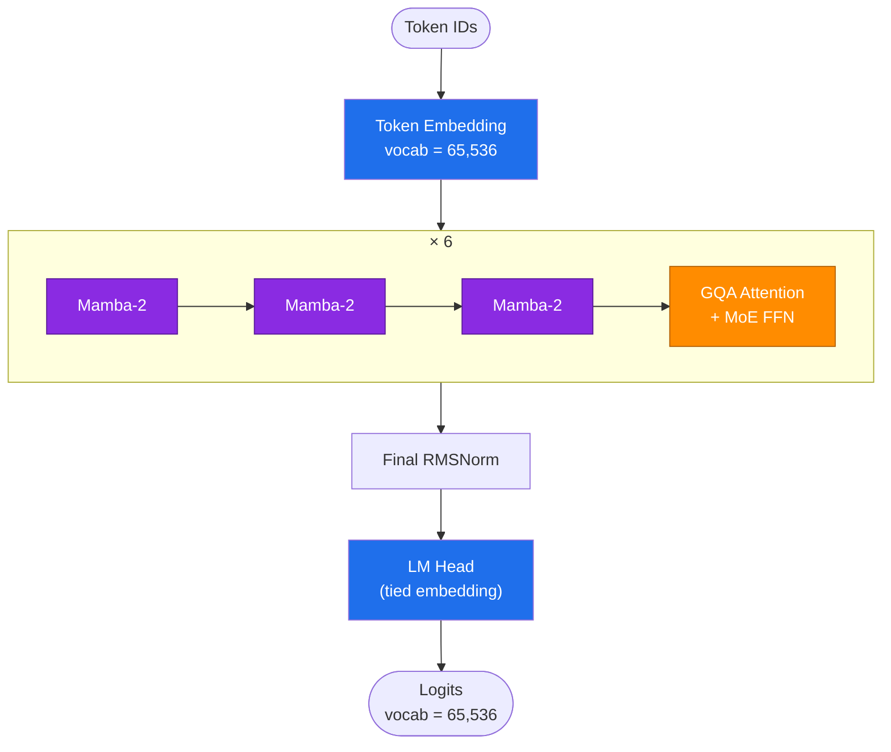
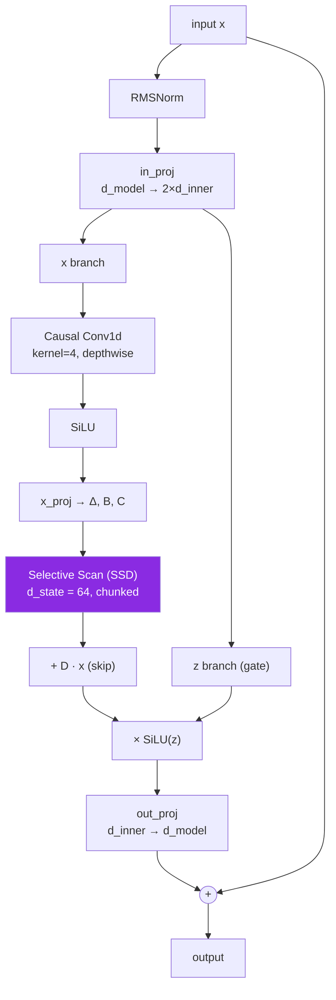
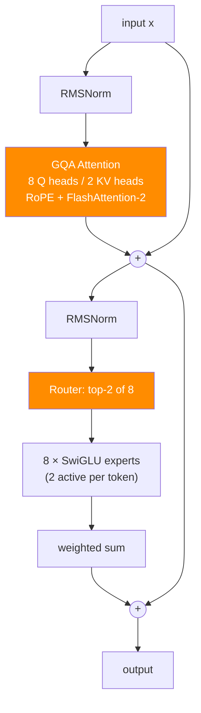

<div align="center">

# 🌙 Lunami Mini

### A 165M parameter language model trained completely from scratch.

🚀 **From-scratch pretraining** — no fine-tuning, no wrapper around someone else's weights
🧠 **165M active parameters** (293M total — sparse Mixture-of-Experts)
⚡ **Hybrid Mamba-2 + GQA + MoE** — state-space speed, attention where it counts
📚 **English + Code** — narrow on purpose, strong where it matters
🔥 **FlashAttention-2** + fused SDPA
🐍 **Pure PyTorch** — every tensor shape hand-written, every bug hand-caught
📄 **MIT License** — fully open, right down to the tokenizer

[](#architecture)
[](#architecture)
[](#tokenizer)
[](LICENSE)
[](#project-status)

</div>

---

## Why this exists

Most "build an LLM" side projects stop at the architecture diagram. This one doesn't — it has a real tokenizer trained on a real corpus, a real training loop that has moved real loss on real GPUs, and a real, load-bearing bug list of things that broke and got fixed along the way. Scope is deliberately narrow: **English + Code only.** No multilingual spread, no diluted capacity — one thing, done properly, on a hobbyist compute budget.

## Architecture

A hybrid of state-space and attention, with sparse compute on top — 24 layers, repeating `[Mamba-2 ×3 → GQA+MoE ×1]` six times:



<details>
<summary><b>Inside a Mamba-2 block</b> (18 of 24 layers — click to expand)</summary>



</details>

<details>
<summary><b>Inside a GQA + MoE block</b> (6 of 24 layers — click to expand)</summary>



</details>

| Component | Spec | Notes |
|---|---|---|
| **Mamba-2 blocks** (18/24) | `d_state=64`, `expand=2`, `conv_kernel=4` | Chunkwise selective scan (SSD), pure PyTorch, autograd-safe |
| **GQA attention** (6/24) | 8 query heads / 2 KV heads, `head_dim=96` | RoPE, fused SDPA (FlashAttention-2 path) |
| **FFN** | Mixture-of-Experts, 8×SwiGLU, top-2 routing | Load-balancing aux loss, gradient flows through the router |
| **Norm / embeddings** | RMSNorm, tied input/output | `d_model=768`, context up to 8,192 tokens |
| **Tokenizer** | SentencePiece BPE, 65,536 vocab | Byte-fallback, ChatML special tokens |
| **Scale** | **~165.5M active / token**, ~293M stored | Sparse MoE — Mixtral-style active/total split, at hobbyist scale |

## Engineering, not just architecture

The interesting part of this project isn't the layer list — it's what it took to make it *actually run*. A sample of what got found and fixed by running real code, not by reading it:

- **A NaN time-bomb in the selective scan.** The naive cumulative-product formulation of chunked SSD underflows to `inf`/`NaN` within the first few steps under S4D-linspace init. Fixed by never dividing by an accumulated product — only ever multiplying by a bounded, monotonically-decaying term.
- **A tokenizer audit across 8 model families** (Llama 3, Qwen, DeepSeek, Gemma, Mistral, SmolLM2, Phi-4, GPT) before writing a line of tokenizer code — landed on `byte_fallback=True` + `identity` normalization (not NFKC — it silently collapses code whitespace) + no dummy prefix.
- **A silent infinite loop in the data pipeline**, found only by watching GPU utilization graphs during a live run: a train/val split reserved 2,000 packed windows for validation by design (correct at production scale) — but a small local dataset never got past that reserve, so training looped forever without a single real batch. One-line fix, found only because the mechanics were actually run end-to-end.
- **Honest throughput math before burning compute.** Measured, not assumed: this reference (non-fused) Mamba-2 implementation does ~330 tok/s on a T4. Real numbers, tracked through the whole compute budget — see [Project status](#project-status).

## Tokenizer

Custom-trained SentencePiece BPE, verified round-trip on code indentation, tabs, newlines, emoji, and Unicode before ever touching the model:

```python
>>> sp.encode("def f():\n\treturn 1\n")
['def', '▁f', '(', ')', ':', '<0x0A>', '<0x09>', 're', 't', 'u', 'r', 'n', '▁1', '<0x0A>']
>>> sp.decode(sp.encode(text)) == text
True   # tabs and newlines survive, byte-for-byte
```

## Data

v1 is **English + Code only** — 50/50 mix, all sources public, no gated access or HF token required:

| Source | Role | Weight |
|---|---|---|
| [FineWeb-Edu](https://huggingface.co/datasets/HuggingFaceFW/fineweb-edu) | English pretrain | 40% |
| [codeparrot-clean-train](https://huggingface.co/datasets/codeparrot/codeparrot-clean-train) | Python pretrain | 40% |
| [Magicoder-OSS-Instruct-75K](https://huggingface.co/datasets/ise-uiuc/Magicoder-OSS-Instruct-75K) | code instruct | 10% |
| [OpenHermes-2.5](https://huggingface.co/datasets/teknium/OpenHermes-2.5) | English chat | 10% |

## Setup

```bash
pip install -r requirements.txt
```

## Usage

1. **Train the tokenizer** — put English text and code files into `tokenizer_corpus/`, then:
   ```bash
   python tokenizer_train.py
   ```
   Produces `tokenizer/tokenizer.model` + `tokenizer/tokenizer.vocab`.

2. **Train the model** (data streams directly from HuggingFace, no manual download needed):
   ```bash
   python train.py --profile workhorse   # or rocket
   ```
   Resume training: `python train.py --profile workhorse --resume checkpoints/step_5000.pt`

3. **Chat with the model**:
   ```bash
   python chat.py --checkpoint checkpoints/step_50000.pt
   ```

## Project status

- [x] Architecture implemented and validated live — real forward/backward passes, finite loss, on real GPUs (RTX 2050 → T4)
- [x] Tokenizer trained on a real 1.1GB EN+Code corpus, 65,536 vocab, round-trip verified on code/emoji/Unicode
- [x] Full data pipeline (streaming, mixing, packing, ChatML loss masking) validated with real HuggingFace data
- [x] Training loop validated end-to-end at full model scale on T4 (ctx=2048): **loss 11.39 → 9.07 over 113 real steps**
- [x] Checkpoint save/resume and `chat.py` inference validated against a real on-disk checkpoint (not just an in-memory model)
- [x] **Real training run in progress** on Lightning.ai T4 — measured throughput ~330 tok/s
- [ ] Full-scale training at ctx=8192 (confirmed T4 OOMs even at `micro_batch=1` at full context — needs A100)
- [ ] Fast Mamba backend (`mamba_ssm` fused kernels) wired in but not yet verified on GPU — build environment issues, see `verify_fast_mamba.py`

## The honest compute problem

This reference Mamba-2 implementation is pure PyTorch — no fused CUDA kernels. Measured throughput on a T4 is ~330 tok/s. A full budget of T4-hours on this project caps out around **~90M tokens** — roughly **35-40x short** of the ~3.3B-token Chinchilla-minimum for a 165M-active-parameter model. The architecture and pipeline are proven correct end-to-end; what's missing is raw compute, not engineering. That's the actual ask behind this project: more GPU-hours turn a validated pipeline into a real model.

## Known limitations

- `model.py` does not implement an incremental KV-cache (the `use_cache` parameter is a stub) — generation in `chat.py` uses honest full-recompute. A real cache is future work, not part of v1.
- Development started on a consumer GPU (RTX 2050, 4GB) — enough to validate the full pipeline, not enough for real-scale pretraining.
- The fused `mamba_ssm` backend is wired into `model.py` (automatic fallback if unavailable) but hasn't been confirmed working on hardware yet — the reference PyTorch scan is what's actually training right now.

## License

MIT — see [LICENSE](LICENSE).
