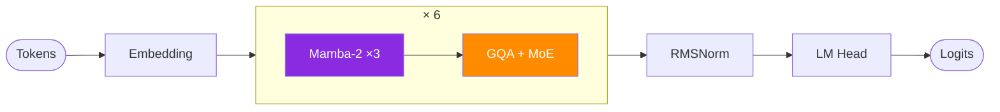
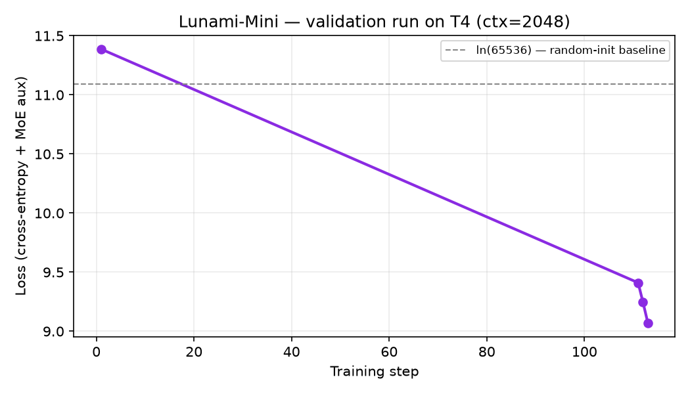
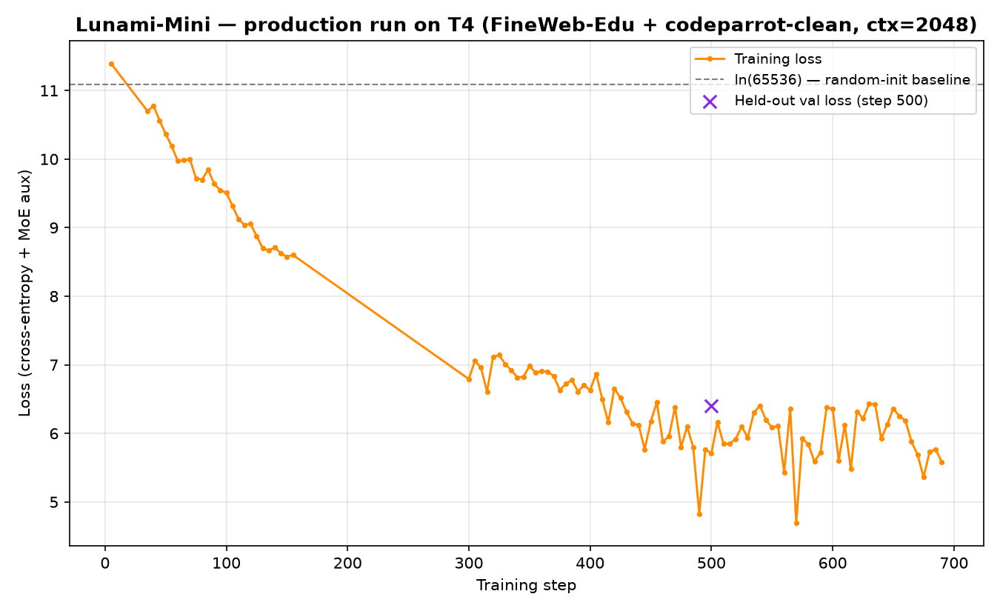

<div align="center">

# 🌙 Lunami Mini

### A 165M-parameter language model, trained from scratch.

🚀 From-scratch pretraining — no fine-tuning, no wrapper around existing weights
🧠 165M active parameters (293M total — sparse Mixture-of-Experts)
⚡ Hybrid Mamba-2 + GQA + MoE
📚 English + Code
🔥 FlashAttention-2
🐍 Built entirely in PyTorch, without relying on existing LLM implementations
📄 MIT License

[](docs/architecture.md)
[](docs/architecture.md)
[](docs/tokenizer.md)
[](LICENSE)
[](#status)

</div>

---

An independent language model project: English + Code only, no multilingual spread. Hybrid Mamba-2 / GQA-Transformer / MoE architecture, ~165M active parameters. Every component — tokenizer, model, training loop, inference — is implemented in this repository rather than imported from an existing model.

## Architecture

24 layers, repeating `[Mamba-2 ×3 → GQA Attention + MoE ×1]` six times. Full diagrams and component breakdown in [docs/architecture.md](docs/architecture.md).



## Benchmarks

No downstream evaluation (MMLU or similar) yet — at the current token count the model is far too undertrained for that to be meaningful. What's tracked instead: training loss, perplexity, and raw samples.

Validation run on a T4, context length 2048, single data source (see [docs/training.md](docs/training.md) for the full setup):



| Step | Loss | Perplexity |
|---|---|---|
| 1 | 11.3868 | ~88,000 |
| 111 | 9.4107 | ~12,200 |
| 112 | 9.2447 | ~10,350 |
| 113 | 9.0698 | ~8,700 |

**Production run, in progress** — same architecture, full data mix (FineWeb-Edu + codeparrot-clean), T4, `workhorse` profile:



| Step | Loss | Perplexity | tok/s |
|---|---|---|---|
| 5 | 11.3929 | ~88,700 | 331 |
| 50 | 10.3655 | ~31,700 | 327 |
| 100 | 9.5078 | ~13,500 | 329 |
| 150 | 8.5769 | ~5,310 | 330 |
| 300 | 6.7922 | ~891 | 333 |
| 400 | 6.6307 | ~758 | 334 |
| 500 | 5.7071 | ~301 | 334 |
| 600 | 6.3581 | ~577 | 334 |
| 690 | 5.5810 | ~265 | 334 |

Perplexity has dropped roughly two orders of magnitude from step 5 to step 690, though not monotonically — batch-size-8 noise means individual milestones can read worse than an earlier one (step 600 vs. 500). First held-out validation eval, at step 500: `val_ppl 600.06`, about 2x the training perplexity at the same step — an expected train/val gap this early, not a red flag. Throughput has crept up from ~328 to ~334 tok/s over the run. Updated as training continues — see [docs/training_log.md](docs/training_log.md) for the full record.

## Samples

Real output from a real checkpoint, not cherry-picked or edited. Step 30 (~500K tokens of training) — early enough that this is expected to be close to noise:

> **Prompt:** `Hello, how are you?`
> **Output:** `Blog HashMark Thailanductakachronouslytoo retailer Bytes substitutingIUS filetypegarhcardProvision Claim decadecuits thymDatagram inaccur Chryschief andutions InvenioOutOfRange bargaining [...]`

Step 150 (~2.5M tokens of training) — loss has dropped from ~11.4 to ~8.6, but output is still noise, just noise built from more common English word fragments:

> **Prompt:** `Hello, how are you?`
> **Output:** `situated to the portraits defines). noted Africa insects. orsubparsers emphasizes thatun test of the...Jresponse Firstadding billions better also and and teachings Court in express Food._ standard as developedturned Lub. calls colonies of the7 voted`

Step 675 (~11M tokens of training) — still no coherent meaning, but short grammatical fragments are starting to show up (`This year is an important part of` is a complete, correctly-formed clause):

> **Prompt:** `Hello, how are you?`
> **Output:** `on the same (for 1984). The Catholic. The oldest-27-79993-65 (1) is a day in the first 2009. This year is an important part of`

Step 3150 (~100M tokens of training, ctx=2048) — still not a coherent reply, but real Python syntax is showing up intact (import → class → docstring, in the right order):

> **Prompt:** `Hello, how are you?`
> **Output:** `Each person? Should you?  """  # get the main module # from __future__ import print_function  import re  from ansible.module_utils.six import AnsibleModule  class types(object):     """     A version class for`

This section will be updated with later checkpoints as training progresses — see [docs/training_log.md](docs/training_log.md) for the running record.

## Data

English + Code only, 50/50 mix, all public sources (no gated access or HF token required). Full mixing details in [docs/training.md](docs/training.md).

| Source | Role | Weight |
|---|---|---|
| [FineWeb-Edu](https://huggingface.co/datasets/HuggingFaceFW/fineweb-edu) | English pretrain | 40% |
| [codeparrot-clean-train](https://huggingface.co/datasets/codeparrot/codeparrot-clean-train) | Python pretrain | 40% |
| [Magicoder-OSS-Instruct-75K](https://huggingface.co/datasets/ise-uiuc/Magicoder-OSS-Instruct-75K) | code instruct | 10% |
| [OpenHermes-2.5](https://huggingface.co/datasets/teknium/OpenHermes-2.5) | English chat | 10% |

## Setup

```bash
pip install -r requirements.txt
```

## Usage

1. **Train the tokenizer** — put English text and code files into `tokenizer_corpus/`, then:
   ```bash
   python tokenizer_train.py
   ```
   Produces `tokenizer/tokenizer.model` + `tokenizer/tokenizer.vocab`.

2. **Train the model** (data streams directly from HuggingFace):
   ```bash
   python train.py --profile workhorse
   ```
   Resume: `python train.py --profile workhorse --resume checkpoints/step_5000.pt`

3. **Chat with a checkpoint**:
   ```bash
   python chat.py --checkpoint checkpoints/step_50000.pt
   ```

## Status

- [x] Architecture implemented and validated with real forward/backward passes on real GPUs (RTX 2050 → T4)
- [x] Tokenizer trained on a real 1.1GB EN+Code corpus, round-trip verified on code/emoji/Unicode
- [x] Data pipeline (streaming, mixing, packing, ChatML loss masking) validated with real HuggingFace data
- [x] Training loop validated at full model scale on T4 — see [Benchmarks](#benchmarks)
- [x] Checkpoint save/resume and `chat.py` inference validated against a real on-disk checkpoint
- [x] Training run in progress on a T4 — see [docs/training_log.md](docs/training_log.md)
- [ ] Full context (8,192 tokens) — needs an A100, not yet run (see [docs/roadmap.md](docs/roadmap.md))
- [ ] Fused `mamba_ssm` backend — wired in, not yet verified on a GPU (see [docs/engineering.md](docs/engineering.md))

## Documentation

- [docs/architecture.md](docs/architecture.md) — full diagrams and component breakdown
- [docs/tokenizer.md](docs/tokenizer.md) — tokenizer design and verification
- [docs/training.md](docs/training.md) — data mixing, hardware profiles, what's actually been run
- [docs/engineering.md](docs/engineering.md) — bugs found and fixed, with root causes
- [docs/roadmap.md](docs/roadmap.md) — known limitations and what's next
- [docs/training_log.md](docs/training_log.md) — running development log

## License

MIT — see [LICENSE](LICENSE).
