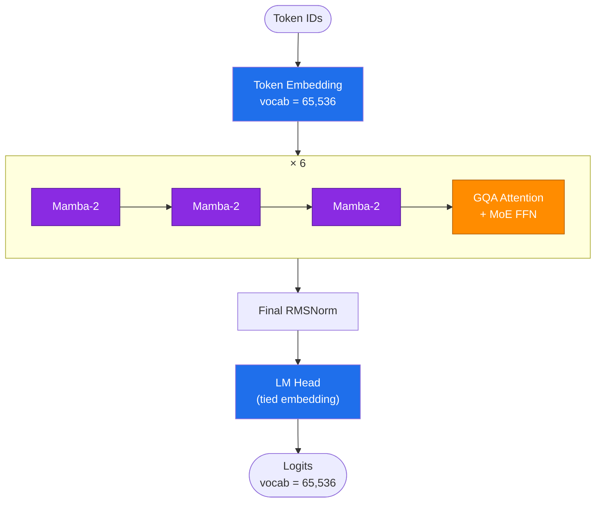
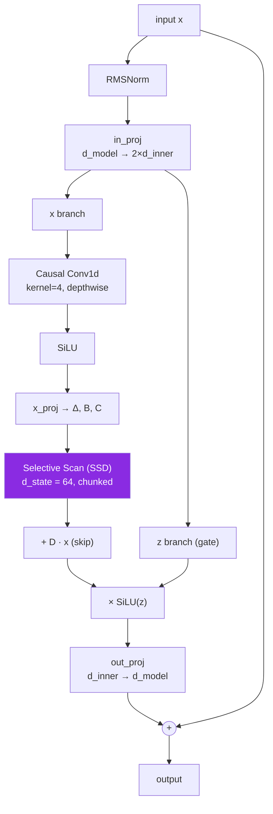
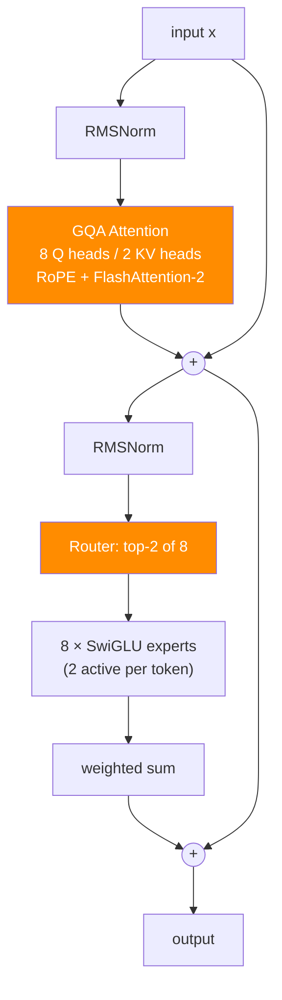

# Architecture

Current implementation: 24 layers, repeating `[Mamba-2 ×3 → GQA Attention + MoE ×1]` six times.

## Mamba-2 block (18 of 24 layers)

The selective scan is implemented as a chunkwise algorithm (SSD-style) in plain PyTorch — no `mamba_ssm` dependency required to run. An optional fused backend (`mamba_ssm`) can be used instead when installed; see [engineering.md](engineering.md#fast-mamba-backend).

## GQA + MoE block (6 of 24 layers)

## Component summary

| Component | Spec | Notes |
|---|---|---|
| Mamba-2 blocks (18/24) | `d_state=64`, `expand=2`, `conv_kernel=4` | Chunkwise selective scan (SSD), pure PyTorch, autograd-safe |
| GQA attention (6/24) | 8 query heads / 2 KV heads, `head_dim=96` | RoPE, fused SDPA (FlashAttention-2 path) |
| FFN | Mixture-of-Experts, 8×SwiGLU, top-2 routing | Load-balancing aux loss, gradient flows through the router |
| Norm / embeddings | RMSNorm, tied input/output | `d_model=768`, context up to 8,192 tokens (see [training.md](training.md) for what's actually been run) |
| Tokenizer | SentencePiece BPE, 65,536 vocab | See [tokenizer.md](tokenizer.md) |
| Scale | ~165.5M active parameters/token, ~293M total stored | Sparse MoE — active/total split similar in spirit to Mixtral, at a much smaller scale |

Parameter counts are measured directly from `model.num_parameters()` on the instantiated model, not estimated — see `count_parameters()` / `count_parameters_real()` in `config.py` / `model.py` for the breakdown by component.
